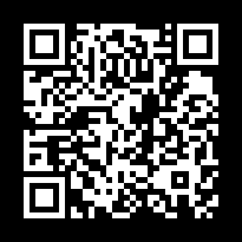

## What is OSS2FA?

OSS2FA is a two-factor authentication (2FA) framework that helps you integrate modern multi-factor authentication solutions in all of your projects.

- **Simple** - With a minimal API surface, oss2fa is designed to be easy to learn and simple to use
- **Modern** - In addition to established device types, such as email and sms, OSS2FA ships with built-in support for Yubikeys, HOTP/TOTP, and FIDO U2F tokens. 
- **Extensible** - Adding support for new devices, or adapting behavior of existing modules is as simple as it gets.
- **Integrations** - Use OSS2FA to provide 2FA support for a variety of projects: whether it is a Citrix Netscaler environment, a VPN appliance, or an Identity Management solution, OSS2FA can help. 

## Documentation

## Install

Install with Docker:

```bash
docker run --name oss2fa -d oss2fa
```

You should see a command output similar to:

```bash
oss2fa_1  | ===> OSS2FA bootstrap complete!
oss2fa_1  | ===> To get you started, we have created a default tenant and integration.
oss2fa_1  | ===> Integration (name=`Default`, access_key=`cUWpf8Jz7aQKFqY5pkQVY5lsfjzRBeQN`, secret_key=`CVrMbfDlwm7bRjPOGpb4grz3r9TnVYhEMb0SPe1uC5HsasFd`)
```

For your convenience, a default tenant and integration have been created on your behalf. 

### Architecture Overview

The oss2fa architecture is composed of a few building blocks.

#### Tenant

The framework ships with built-in support for multi-tenancy. It is a perfect candidate to be used within 
corporations where projects are often owned by a large amount of teams.

#### Integration

An integration is an abstraction for an application that is to be protected with oss2fa. For example, an organization 
looking to protect its VPN appliances and a web application, will need two integrations. An integration belongs to a tenant.
 
#### Client

A client is the end-user of the system; it is the individual that is undergoing 2fa.

#### Enrollment

An enrollment is the process of on-boarding a client into an integration.

#### Device

A device is an abstraction of ways which a user can answer a 2fa challenge. For example, an email account, 
and a Yubikey token are considered devices within oss2fa.

#### Challenge

A challenge is the process of challenging a client to a 2fa session. 


### Example

#### Creating an enrollment

To create an enrollment:

```text
POST /integrations/enrollments HTTP/1.1
```

```text
Host: 127.0.0.1:8300
Accept: application/json; version=1.0
X-Integration-Token: CVrMbfDlwm7bRjPOGpb4grz3r9TnVYhEMb0SPe1uC5HsasFd
```


```json
{
  "username": "john.doe"
}
```

This will yield a response such as:

```json
{
  "pk": 1,
  "device_selection": null,
  "username": "john.doe",
  "status": 1,
  "created_at": "2017-08-27T23:47:31.544021Z",
  "expires_at": "2017-08-27T23:52:31.543721Z",
  "public_details": null
}
```

#### Choosing to enroll a TOTP device

Once an enrollment is created, the framework needs to know which device will be used to complete the enrollment:

```text
POST /integrations/enrollments/1/prepare-device HTTP/1.1
```

```text
Host: 127.0.0.1:8300
Accept: application/json; version=1.0
X-Integration-Token: CVrMbfDlwm7bRjPOGpb4grz3r9TnVYhEMb0SPe1uC5HsasFd
```

```json
{
  "kind": "TOTP",
  "options": {
    "generate_qr_code": true
  }
}
```

A response containing enrollment information is presented:

```json
{
  "pk": 1,
  "device_selection": 1,
  "username": "test_1",
  "status": 2,
  "created_at": "2017-08-28T00:21:38.335930Z",
  "expires_at": "2017-08-28T00:26:38.335628Z",
  "public_details": {
    "provisioning_uri": "otpauth://totp/pymfa:test_1?secret=DNHT6VK4J7AP2CBEZARS6EIQDODKULK7&issuer=pymfa",
    "qr_code": "iVBORw0KGgoAAAANSUhEUgAAAZoAAAGaCAIAAAC5ZBI0AAAHr0lEQVR4nO3dQXIbORAAQXnD//+y97on2GEI20Ax804OxaEqcGhgvr4AAAAAAAAAAAAAAAAAAAAAAAAAAAAAAAAAAAAAAAAAAAAAAAAAAAAAAAAAAAAAAKDrx9SFf/36NXXpQ378+Psv89y3sf5UL96Fne/5nPU32bsLa1P36J+RqwJ8OzkDIuQMiJAzIELOgAg5AyLkDIiQMyBCzoCIS3cF9Ca/z5maKb9zF8Q55+7vnb+rtTs/s9UZECFnQIScARFyBkTIGRAhZ0CEnAERcgZEyBkQ8XP6A/yNqZP1z7nzWQFT38aL+w2mvsne/8IOqzMgQs6ACDkDIuQMiJAzIELOgAg5AyLkDIiQMyDiyV0BL9qZGt+Z/J667rnJ/vU7T+2CeHGGvsfqDIiQMyBCzoAIOQMi5AyIkDMgQs6ACDkDIuQMiLAr4HnnJvt3nJu/n3rnHfYM/D+szoAIOQMi5AyIkDMgQs6ACDkDIuQMiJAzIELOgIgndwW8OGP9abP756577lP1flefxuoMiJAzIELOgAg5AyLkDIiQMyBCzoAIOQMi5AyIuHRXwNSU/Dk7c/BTZ9if+8xe++d6/wvnWJ0BEXIGRMgZECFnQIScARFyBkTIGRAhZ0CEnAERY7sCPu2M86mZcr7LuXvk/n4XqzMgQs6ACDkDIuQMiJAzIELOgAg5AyLkDIiQMyBibFfAzgno56aop07lX5s6h/7FafUXP/OOO/+PplidARFyBkTIGRAhZ0CEnAERcgZEyBkQIWdAhJwBEWO7AtbOTbqfu+6OnScJnLvuuXd+cTfC1O6Lc3f/xf+UNaszIELOgAg5AyLkDIiQMyBCzoAIOQMi5AyIkDMg4tJdAecmoXdMzXbfOTW+Mxc+9Red47u6gdUZECFnQIScARFyBkTIGRAhZ0CEnAERcgZEyBkQcemugB0vnul+7mT99WvvPMO+dwd3mPv/c1ZnQIScARFyBkTIGRAhZ0CEnAERcgZEyBkQIWdAxKlR5t+amik/NzV+bpZ9x9SnenFHwdqdd//O3QjnPtWa1RkQIWdAhJwBEXIGRMgZECFnQIScARFyBkTIGRAx9qyAO2fo16Ym3Xfcufvi00xN2L+4r2OH1RkQIWdAhJwBEXIGRMgZECFnQIScARFyBkTIGRARfFbAlKnnDEy5c7/Bp32Td+4ZmGJ1BkTIGRAhZ0CEnAERcgZEyBkQIWdAhJwBEXIGRNw42vu1N/l954z1uSnqO6fzz113yqc9oeLFvRlWZ0CEnAERcgZEyBkQIWdAhJwBEXIGRMgZECFnQMSN49e/ZRL6u5z7i148h37q27jznV9kdQZEyBkQIWdAhJwBEXIGRMgZECFnQIScARFyBkR81tBw0tQZ9mtTz3PoPWXi3HXX7vxUa1ZnQIScARFyBkTIGRAhZ0CEnAERcgZEyBkQIWdAxM+pC09Nb0+5c0p+x9RzFXqn4+98k3fe3ylWZ0CEnAERcgZEyBkQIWdAhJwBEXIGRMgZECFnQMTYroC1qVnnc87tgujtr5j6VFPn7u9ct/eMgh1WZ0CEnAERcgZEyBkQIWdAhJwBEXIGRMgZECFnQMTYaO+LJ773pqhf3FFw5+z+1G9j6ikTd/6erc6ACDkDIuQMiJAzIELOgAg5AyLkDIiQMyBCzoAIzwr4n167484T/admyqem1e+87tqds/vnWJ0BEXIGRMgZECFnQIScARFyBkTIGRAhZ0CEnAERl+4KmDo9feqd13/vnWf2vzj3P3Wy/s4733n372R1BkTIGRAhZ0CEnAERcgZEyBkQIWdAhJwBEXIGRFy6K2BtahL63On4O6/t7aA4d8L91GT/2p37OnZeO/WMAqszIELOgAg5AyLkDIiQMyBCzoAIOQMi5AyIkDMgYmZ49+vWM87Pze6v3TlDf+c92vHi7P45U7P751idARFyBkTIGRAhZ0CEnAERcgZEyBkQIWdAhJwBEWPPCnhxIvncTHlvR8HUcxV2nHvn3s4NzwoAOEjOgAg5AyLkDIiQMyBCzoAIOQMi5AyIkDMgYmxXgJPX/2tnxnpnhv7F6fzeef93Ttjf+anWrM6ACDkDIuQMiJAzIELOgAg5AyLkDIiQMyBCzoCIsV0Ba3fOHN85U37Ozt9752T/1D6HtTuf2PAiqzMgQs6ACDkDIuQMiJAzIELOgAg5AyLkDIiQMyBibPj+zlPqd657brZ7ag7+ztfe6c4J+xe/yR1WZ0CEnAERcgZEyBkQIWdAhJwBEXIGRMgZECFnQMSlzwrgu5w773/H1J6Bc/sr7vyLpq47tRvB6gyIkDMgQs6ACDkDIuQMiJAzIELOgAg5AyLkDIiwK+ABU3Pwa1Mz5efm0XvPN7jzl3OO1RkQIWdAhJwBEXIGRMgZECFnQIScARFyBkTIGRDx5K6AOyew1148tb33rICd6+4494s99xe9+F9mdQZEyBkQIWdAhJwBEXIGRMgZECFnQIScARFyBkRcuivgxXPKd9x5Dn1vhv7cdV+cv+89G8HqDIiQMyBCzoAIOQMi5AyIkDMgQs6ACDkDIuQMAAAAAAAAAAAAAAAAAAAAAAAAAAAAAAAAAAAAAAAAAAAAAAAAAAAAAAAAAAAAAAAArvcvDAqW7GqwIOoAAAAASUVORK5CYII="
  }
}
```

Notice that we have requested the framework to generate the qr code on our behalf. It is a base64 encoded PNG image:




#### Finalizing the enrollment

After importing the token in your favorite authenticator application, you
can proceed to provide the current secret to the enrollment endpoint to finalize the process:
 
```text
POST /integrations/enrollments/1/complete HTTP/1.1
```

```text
Host: 127.0.0.1:8300
Accept: application/json; version=1.0
X-Integration-Token: CVrMbfDlwm7bRjPOGpb4grz3r9TnVYhEMb0SPe1uC5HsasFd
```

```json
{
  "token": "12345"
}
```

If everything is ok, the framework will return a 201 status, and set a client id header:

```text
Content-Length: 0
Vary: Accept
X-Client-Id: 1
Allow: POST, OPTIONS
X-Frame-Options: SAMEORIGIN
```


